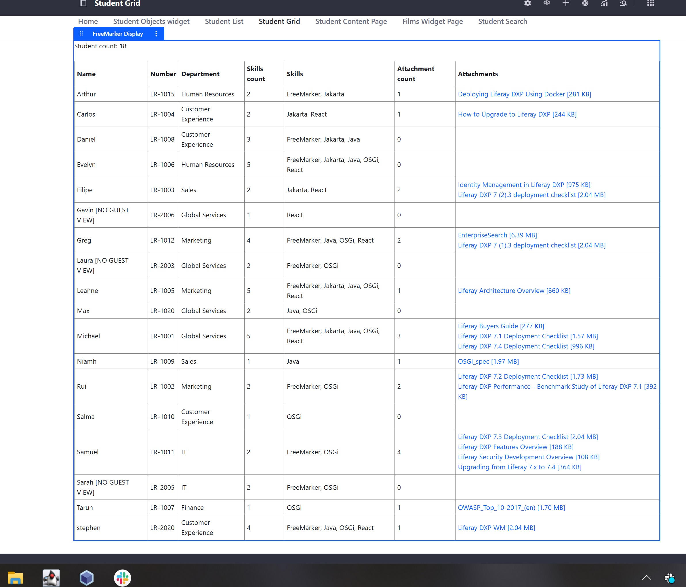
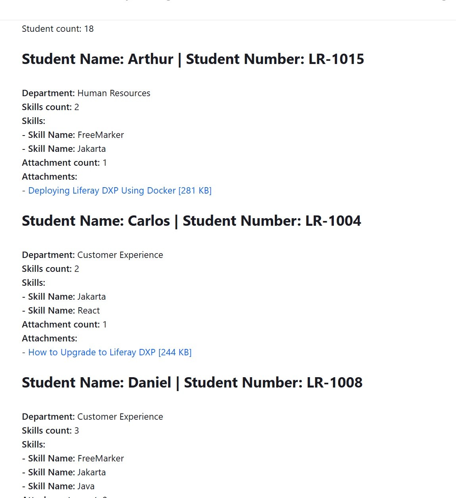

## Introduction ##
- This is an OSGi based Liferay MVC Widget that uses FreeMarker Templates to display Liferay Objects recordsets.
  - The solution is OSGi based so is compatible with Liferay PaaS and Liferay Self Hosted but is not compatible with Liferay SaaS.
- The Liferay DDL functionality is deprecated and marked for removal.
  - Liferay Objects is the replacement for DDL. See [here](https://learn.liferay.com/w/dxp/low-code/forms/dynamic-data-lists/migrating-to-liferay-objects) for more information on DDL to Liferay Objects migration.
- This widget was built as a POC for the use case of a customer migrating existing DDL Lists to Liferay Objects where the customer use the DDL 'Display Templates' functionality.
- It is intended as a replacement for the DDL 'Display Templates' functionality for DDL Lists that have been migrated from DDL to Liferay Objects.

## Features ##
- Display records for an Object using a FreeMarker Template
  - Widget can be used on Content Pages and Widget Pages.
  - Compatible with ‘Convert to content page…’.
  - Widget is Instanceable meaning Widget can be included multiple times on the same page.
- Permission Aware Objects Records
  - Renders Object Records for Authenticated and Guest users based on Object Record permissions.
  - For both ‘main’ Object Record permissions and ‘related’ Object Record permissions.
- Object Scope
  - Works with both Company and Site Scoped Objects.
- Localization Aware
  - If Object Entries are not to be translated then turn 'Enable Entry Translation' off when the Object Definition is being created.
  - If 'Enable Entry Translation' is enabled and the user is authenticated then the Locale used is themeDisplay.getLocale().
  - If 'Enable Entry Translation' is enabled and the user is unauthenticated then the Locale used is LocaleUtil.getDefault().
  - If 'Enable Entry Translation' is disabled then the Locale used is LocaleUtil.getDefault().
  - **Be aware that enabling 'Enable Entry Translation' and not translating field values for a language may result in empty field values being displayed if that language is used by the widget.**
- Configuration Driven
  - TemplateObjectDefinition Liferay Object stores FreeMarker Templates.
  - Widget Configuration to map to TemplateObjectDefinition Record and Object Definition.
  - A FreeMarker Template can be used by different Object Definitions.
  - An Object Definition can be used with different FreeMarker Templates e.g. Student List and Student Table to show the same set of Liferay Objects records in different formats.
- Portable Configuration
  - User Defined External Reference Codes (ERCs) used to map configuration.
  - Widget Configuration is Portable for Staging usage.

## DDL Object vs Object Definition ##
- A DDL Radio is an Objects Picklist Field.
- A DDL Select Single is an Objects Picklist Field.
- A DDL Select Multiple is an Objects Multiselect Picklist Field.
- A DDL Documents and Media is an Objects Attachment Field.
- A DDL Repeatable Field is implemented as an Objects Relationship.

## Custom Helper Classes ##
- Custom helper classes are provided in the FreeMarker context as follows:
  - ObjectEntryHelper
  - PicklistHelper
  - RelationshipHelper
  - AttachmentFieldHelper
- These help reduce the complexity of the FreeMarker templates and also remove the need to use serviceLocator for example.

## ObjectEntryHelper ##
- ObjectEntryHelper for retrieving the records with default sort etc.
```
<#assign records = objectEntryHelper.getRecords("studentName", true, objectDefinition, locale, themeDisplay.siteGroup)>
```
## PicklistHelper ##
- PicklistHelper for working with Picklists.
- getEntryNames and getEntryNamesList are sorted by Picklist item name.
```
<#assign department = picklistHelper.getEntryName(picklist_department, cur_rec.values["department"], languageId)>
```
```
<#assign skills = picklistHelper.getEntryNamesList(picklist_skills, cur_rec.values["skills"], languageId)>
```
## RelationshipHelper ##
- RelationshipHelper for working with Relationships.
- getRecordsSorted sorts by the Title value set on the Object Definition.
```
<#assign attachments = relationshipHelper.getRecordsSorted(relationship_studentAttachments, cur_rec.objectEntryId, languageId)>
```
## AttachmentFieldHelper ##
- AttachmentFieldHelper for rendering File Links e.g. with Label and Size.
```
<#assign attachment = attachmentFieldHelper.getAttachmentURL(themeDisplay, cur_attachment.values.file)>
<a href="${attachment.url}">${cur_attachment.values.name} [${attachmentFieldHelper.sizeFormatted(attachment.size)}]</a><br/>
```

## Setup ##
- Build and deploy the OSGi module com.mw.freemarker.display.web-1.0.0.jar.
- Import the TemplateObjectDefinitions Liferay Object Definition from /liferayObjects/Object_Definition_TemplateObjectDefinition.json.

## Sample ##
- Student Object with Student Name, Student Number, Department, Skills and Attachments.
- Objects:
  - Student: liferayObjects/Object_Definition_Student.json
  - Attachment: liferayObjects/Object_Definition_Attachment.json
- Picklists
  - Department (single): liferayObjects/ListType_Department.json
  - Skills (multi): liferayObjects/ListType_Skills.json
- Relationships
  - One to Many between Student and Attachment
- Examples of Widget
  - Student List Template: freeMarkerTemplates/STUDENT_LIST_TEMPLATE.txt
  - Student Grid Template: freeMarkerTemplates/STUDENT_GRID_TEMPLATE.txt

## Sample Data Setup ##
- Import the Department and Skills Picklists.
- Import the Student and Attachment Liferay Object Definitons.
- Create some Student records and populate Department, Skills and Attachments etc.
- Create a record in TemplateObjectDefinitions Object with the following field values and Save:
  - External Reference Code e.g. STUDENT_LIST_TEMPLATE
  - templateTitle: Student list template
  - templateId: STUDENT_LIST_TEMPLATE
  - templateDescription: Template used to display students list
  - templateContent: see /freeMarkerTemplates/STUDENT_LIST_TEMPLATE.txt
- Create a record in TemplateObjectDefinitions Object with the following field values and Save:
  - External Reference Code: STUDENT_GRID_TEMPLATE
  - templateTitle: Student grid template
  - templateId: STUDENT_GRID_TEMPLATE
  - templateDescription: Template used to display students in table format.
  - templateContent: see /freeMarkerTemplates/STUDENT_GRID_TEMPLATE.txt
- Add the Sample > FreeMarker Display widget to a Content Page or a Widget Page
  - Open the Widget Configuration, populate the following values and Save:
    - Template Object Entry ERC: STUDENT_LIST_TEMPLATE
    - Source Object Definition ERC: STUDENT
- Add the Sample > FreeMarker Display widget to a Content Page or a Widget Page
  - Open the Widget Configuration, populate the following values and Save:
    - Template Object Entry ERC: STUDENT_GRID_TEMPLATE
    - Source Object Definition ERC: STUDENT
- Optionally set Look and Feel Configuration > Application Decorators to 'Barebone' and Save.

## Sample Screenshots ##
- The Student data should be displayed as follows:
  - Student Grid:

  - Student List:


## Known Limitations / TODO ##
- The implementation doesn't currently handle Many to Many relationships.
  - Additional methods can be added to RelationshipHelper.java to support Many to Many relationships.
- Further improvements can be made e.g. to add support for composite sort to ObjectEntryHelper getRecords method.
- Additional Helper classes can easily be added for reusable code to further reduce the complexity of the FreeMarker templates.
- The DDL 'Display Templates' feature was not intended for displaying large quantities of data, the same applies to this widget.
  - Adding pagination support to the widget should be possible if the Liferay Object has many records.

## Environment ##
- The module was built and tested with 2025.Q1.0 (Liferay Workspace gradle.properties > liferay.workspace.product = dxp-2025.q1.0-lts)
- JDK 21 is expected for both compile time and runtime.

## Notes ##
- This is a ‘proof of concept’ that is being provided ‘as is’ without any support coverage or warranty.
- The solution is OSGi based so is compatible with Liferay PaaS and Liferay Self Hosted but is not compatible with Liferay SaaS.
